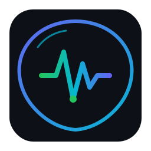

# Skills Health Guardian (SHG) — 品牌视觉规范

> **版本**: 1.0.0  
> **更新日期**: 2026-04-04  
> **设计师**: Chen (SHG Design Team)

---

## 1. 品牌概述

### 1.1 产品定位

**Skills Health Guardian (SHG)** 是一款面向 AI Agent 开发者的环境健康监测工具，为 Agent Skills 提供全方位的「体检」服务——扫描依赖、检测冲突、评估健康度、给出修复建议。

### 1.2 设计理念

> **「给 AI Skills 做体检的全科医生」**

我们的设计语言围绕三个核心关键词展开：

| 关键词 | 设计表达 |
|---------|----------|
| **守护** | 盾牌轮廓、圆角保护空间 |
| **监测** | 心电图脉冲波、雷达扫描 |
| **专业** | 几何精确、代码级精度、开发者审美 |

### 1.3 Logo 方案选择

我们选择了 **方案 C — 抽象字母 S + 脉冲** 作为最终方向：

**选择理由**:
- ✅ 极简高辨识度 — 单字母 S 变形即可识别
- ✅ 单色可逆 — 黑白/彩色/反色场景均适用
- ✅ 技术感强 — 脉冲波形暗示数据流和信号
- ✅ 缩放友好 — 从 16px favicon 到大型横幅都清晰
- ✅ 原创性强 — 不与现有竞品撞车

---

## 2. Logo 规范

### 2.1 主 Logo



**文件**: `logo-shg.svg`  
**尺寸**: 256 × 256 px（viewBox）  
**格式**: SVG（矢量，可无限缩放）

#### 结构说明

```
┌─────────────────────────┐
│  ┌───────────────────┐  │
│  │   S 形盾牌外圈     │  │ ← 渐变描边 (Indigo → Cyan)
│  │   ╭─────────────╮  │  │
│  │  ╱  脉冲波 ~~~~  ╲ │  │ ← 核心心电图线条
│  │  │  ∩      ∪     │ │  │    (绿→青→蓝渐变)
│  │  ╰──── ● ────────╯  │  │ ← 脉冲点(绿色, 可动画)
│  └───────────────────┘  │
│         扫描弧线          │ ← 左上角装饰弧线
└─────────────────────────┘
  圆角矩形背景 #0d1117
```

### 2.2 横版 Logo

**文件**: `logo-shg-horizontal.svg`  
**尺寸**: 480 × 96 px（viewBox）  
**用途**: 导航栏、文档页头、邮件签名、PPT 标题

布局: `[图标 48×48] [SHG 大字] [Skills Health Guardian 小字] [● 状态点]`

### 2.3 Favicon

**文件**: `favicon.svg`  
**尺寸**: 32 × 32 px（viewBox）  
**用途**: 浏览器标签页、书签、应用图标

**优化要点**:
- 移除所有动画效果（浏览器不支持 SVG 动画）
- 简化路径细节（保证 16px 下可辨）
- 保持核心元素：S 外圈 + 脉冲波 + 绿色脉冲点

---

## 3. Logo 使用规则

### 3.1 最小尺寸

| 用途 | 最小尺寸 | 说明 |
|------|----------|------|
| 数字显示 | **24 × 24 px** | 绝不低于此值 |
| 打印输出 | **10 mm 宽** | 保证清晰度 |
| Favicon | **16 × 16 px** | 使用简化版 favicon.svg |

### 3.2 保护空间（Clear Space）

Logo 四周必须保留至少 **Logo 高度 1/4** 的留白区域，不得放置任何文字或图形：

```
┌─────────────────────┐
│ ░░░░░░░░░░░░░░░░░░░ │  ← ≥ H/4 保护区
│ ░░┌───────────┐░░░ │
│ ░░│           │░░░ │
│ ░░│   LOGO    │░░░ │
│ ░░│           │░░░ │
│ ░░└───────────┘░░░ │
│ ░░░░░░░░░░░░░░░░░░░ │
└─────────────────────┘
```

### 3.3 禁用案例 ❌

以下使用方式是 **禁止** 的：

| 错误示例 | 说明 |
|----------|------|
| 拉伸/压扁 | 必须等比缩放 |
| 添加阴影/投影 | 保持扁平风格 |
| 改变配色 | 仅允许单色反转（深色背景用原色） |
| 添加外框/边框 | 保持独立存在 |
| 低透明度 (< 80%) | 保证可见性 |
| 旋转角度 | 仅允许 0° 或 180° |
| 放在复杂背景上 | 需要足够对比度 |

### 3.4 单色模式

在无法使用彩色时，Logo 可转为纯色版本：

```css
/* 深色背景 */
.logo-monochrome-dark { color: #e6edf3; }

/* 亮色背景 */
.logo-monochrome-light { color: #0d1117; }
```

SVG 中所有填充已支持 `currentColor`，可直接通过 CSS 控制颜色。

---

## 4. 色彩系统

### 4.1 品牌主色

| 色彩 | 名称 | HEX | RGB | HSL | 用途 |
|------|------|-----|-----|-----|------|
| 🟣 Primary | Indigo | `#6366F1` | rgb(99, 102, 241) | hsl(239, 84%, 67%) | 品牌主色调、链接、按钮主操作 |
| 🩵 Primary Light | Soft Indigo | `#818CF8` | rgb(129, 140, 248) | hsl(239, 89%, 74%) | Hover 状态、高亮 |
| 💜 Primary Dark | Deep Indigo | `#4F46E5` | rgb(79, 70, 229) | hsl(239, 75%, 59%) | Active/按下状态 |

**选择理由**: Indigo（靛蓝）在科技产品中被广泛关联为「信任」「智能」「创新」，同时与 GitHub 的蓝色、VS Code 的蓝色形成差异化。它偏紫的色调也暗含「守护者」的神秘感。

### 4.2 强调色

| 色彩 | 名称 | HEX | RGB | HSL | 用途 |
|------|------|-----|-----|-----|------|
| 🩵 Accent | Cyan | `#06B6D4` | rgb(6, 182, 212) | hsl(188, 95%, 43%) | 渐变终点、装饰元素、次要强调 |

**选择理由**: Cyan（青色）代表「活力」「清新」「数据流动」，与 Indigo 形成冷暖互补的科技感渐变组合。

### 4.3 语义色（健康状态）

这是 SHG 最核心的色彩语义系统，用于直观传达检测结果：

| 状态 | 名称 | HEX | RGB | 含义 | 场景 |
|------|------|-----|-----|------|------|
| 🟢 Success | Emerald Green | `#22C55E` | rgb(34, 197, 94) | 健康 / 通过 / 正常 | 所有检查通过 |
| 🟡 Warning | Amber | `#F59E0B` | rgb(245, 158, 11) | 警告 / 注意 / 建议 | 版本冲突、配置缺失 |
| 🔴 Danger | Red | `#EF4444` | rgb(239, 68, 68) | 异常 / 错误 / 阻塞 | 关键依赖缺失、安全漏洞 |

### 4.4 中性色（Dark Theme 为主）

SHG 以 **暗色主题** 为主要设计基调（参考 GitHub Dark）：

| 色彩 | 名称 | HEX | RGB | 用途 |
|------|------|-----|-----|------|
| ⚫ BG Primary | GitHub Dark | `#0D1117` | rgb(13, 17, 23) | 页面主背景 |
| ⬛ BG Secondary | Card | `#161B22` | rgb(22, 27, 34) | 卡片、面板背景 |
| 🌑 BG Tertiary | Input | `#21262D` | rgb(33, 38, 45) | 输入框、下拉菜单 |
| ⚪ Text Primary | White-ish | `#E6EDF3` | rgb(230, 237, 243) | 主要文字 |
| 🫥 Text Secondary | Gray | `#8B949E` | rgb(139, 148, 158) | 次要文字、占位符 |
| ⬜ Border | Subtle | `#30363D` | rgb(48, 54, 61) | 边框、分割线 |

### 4.5 CSS 变量速查

```css
:root {
  /* Primary */
  --shg-primary: #6366f1;
  --shg-primary-light: #818cf8;
  --shg-primary-dark: #4f46e5;
  
  /* Accent */
  --shg-accent: #06b6d4;
  
  /* Semantic */
  --shg-success: #22c55e;
  --shg-warning: #f59e0b;
  --shg-danger: #ef4444;
  
  /* Neutral (Dark) */
  --shg-bg-primary: #0d1117;
  --shg-bg-secondary: #161b22;
  --shg-bg-tertiary: #21262d;
  --shg-text-primary: #e6edf3;
  --shg-text-secondary: #8b949e;
  --shg-border: #30363d;
}
```

---

## 5. 字体规范

### 5.1 字体家族

| 用途 | 字体 | 备选 | 特征 |
|------|------|------|------|
| **UI 文字** | Inter | -apple-system, BlinkMacSystemFont, sans-serif | 现代、高可读性 |
| **代码文字** | JetBrains Mono | 'Fira Code', 'Cascadia Code', monospace | 等宽、连字支持 |
| **数字/数据** | JetBrains Mono Tabular Numbers | 同上 | 数字等宽对齐 |

### 5.2 字号层级

| 层级 | 字号 | 字重 | 行高 | 用途 |
|------|------|------|------|------|
| Display | 36px | 700 | 1.2 | 页面大标题 |
| H1 | 28px | 700 | 1.3 | 区块标题 |
| H2 | 22px | 600 | 1.35 | 子标题 |
| H3 | 18px | 600 | 1.4 | 小节标题 |
| Body | 15px | 400 | 1.6 | 正文 |
| Caption | 13px | 400 | 1.5 | 辅助说明 |
| Code | 14px | 400 | 1.6 | 代码/命令 |
| Label | 12px | 500 | 1.4 | 标签/Badge |

---

## 6. 图标集规范

### 6.1 图标清单

| 文件名 | 尺寸 | 用途 | 描述 |
|--------|------|------|------|
| `icon-healthy.svg` | 48×48 | 健康/通过状态 | 绿色圆形 ✓ 徽章 |
| `icon-warning.svg` | 48×48 | 警告/建议状态 | 黄色三角形 ⚠ |
| `icon-error.svg` | 48×48 | 错误/异常状态 | 红色圆形 ✗ 标记 |
| `icon-scanning.svg` | 48×48 | 扫描进行中 | 雷达旋转动画 |
| `icon-dashboard.svg` | 48×48 | 仪表盘入口 | 数据可视化卡片 |

### 6.2 图标技术规格

```yaml
format: SVG (矢量)
viewBox: "0 0 48 48"
stroke-linecap: round
stroke-linejoin: round
max-file-size: 3KB per icon
color-support: currentColor compatible (部分图标)
animation: scanning icon has CSS animation (others static for compatibility)
```

### 6.3 使用场景

| 场景 | 推荐图标 | 尺寸 |
|------|----------|------|
| CLI 终端输出 | healthy/warning/error | 16px (内联 ASCII 替代) |
| Dashboard 状态列 | healthy/warning/error/scanning | 20px |
| 报告摘要头部 | healthy/warning/error | 32px |
| 通知 Badge | healthy/warning/error | 14px |
| 导航菜单项 | dashboard | 20px |
| 加载状态 | scanning | 32-48px |

---

## 7. 应用场景示例

### 7.1 GitHub Badge

```
[]
```

Markdown 引用:
```markdown

```

### 7.2 README 页头

```html
<p align="center">
  
</p>

<h1 align="center">Skills Health Guardian</h1>
<p align="center">
  <strong>AI Agent Skills 环境健康监测工具</strong>
</p>
```

### 7.3 文档水印

```
opacity: 0.05
size: 200px
position: fixed, center
rotation: -30deg
```

仅使用单色（灰色）版本的 logo-shg.svg。

### 7.4 CLI 终端颜色

```python
# Python 示例 — SHG 终端色彩常量
SHG_COLORS = {
    "primary": "\033[38;2;99;102;241m",    # Indigo
    "success": "\033[38;2;34;197;94m",      # Green
    "warning": "\033[38;2;245;158;11m",     # Amber
    "danger": "\033[38;2;239;68;68m",       # Red
    "info": "\033[38;2;6;182;212m",        # Cyan
    "reset": "\033[0m",
}

print(f"{SHG_COLORS['success']}✅ All systems operational{SHG_COLORS['reset']}")
```

### 7.5 npm/Pypi 包徽章配色

| 平台 | Badge 格式 |
|------|-----------|
| npm | `` |
| PyPI | `` |
| Docker | `` |
| License | `` |

---

## 8. 设计资源汇总

### 8.1 文件清单

```
assets/brand/
├── logo-shg.svg              # 主 Logo（方形 256×256）
├── logo-shg-horizontal.svg   # 横版 Logo（480×96）
├── favicon.svg               # 浏览器图标（32×32）
├── icon-healthy.svg          # 健康状态 ✓
├── icon-warning.svg          # 警告状态 ⚠
├── icon-error.svg            # 错误状态 ✗
├── icon-scanning.svg         # 扫描中 🔄
├── icon-dashboard.svg        # 仪表盘 📊
├── brand-guidelines.md       # 本文档
└── showcase.png              # 品牌展示图合集
```

### 8.2 PNG 导出建议

对于不支持 SVG 的场景，推荐以下导出设置：

| 用途 | 尺寸 | 倍率 | 背景 |
|------|------|------|------|
| GitHub Avatar | 512×512 | @1x | 透明 |
| Favicon ICO | 16+32+48 | 多尺寸 | 透明 → #0D1117 |
| PPT 内嵌 | 500×500 | @2x | 透明 |
| 文档配图 | 256×256 | @2x | #0D1117 |
| 社交分享 | 1200×630 | @1x | #0D1117 |

导出工具推荐: [svgexport](https://github.com/shakiba/svgexport)、Figma、Sketch

---

## 9. 版本历史

| 版本 | 日期 | 变更 |
|------|------|------|
| 1.0.0 | 2026-04-04 | 初始品牌系统：Logo、色彩、图标、规范文档 |

---

*本规范由 SHG Design Team 维护。如有疑问或需要新的设计资源，请联系 Chen。*
